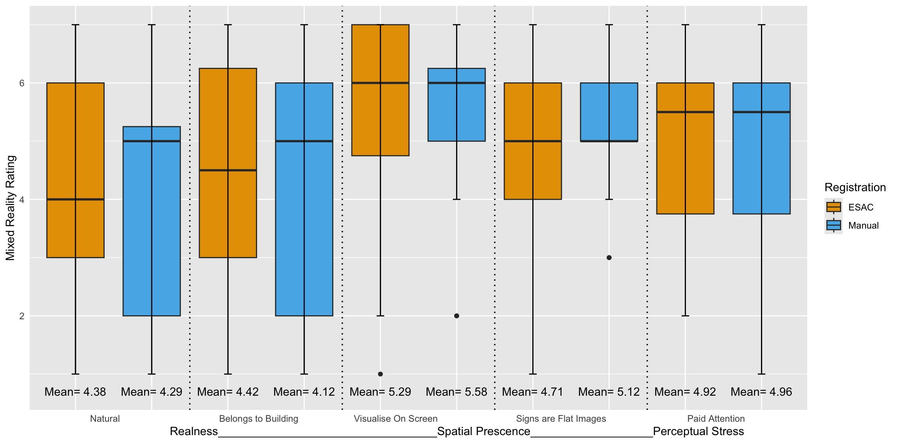
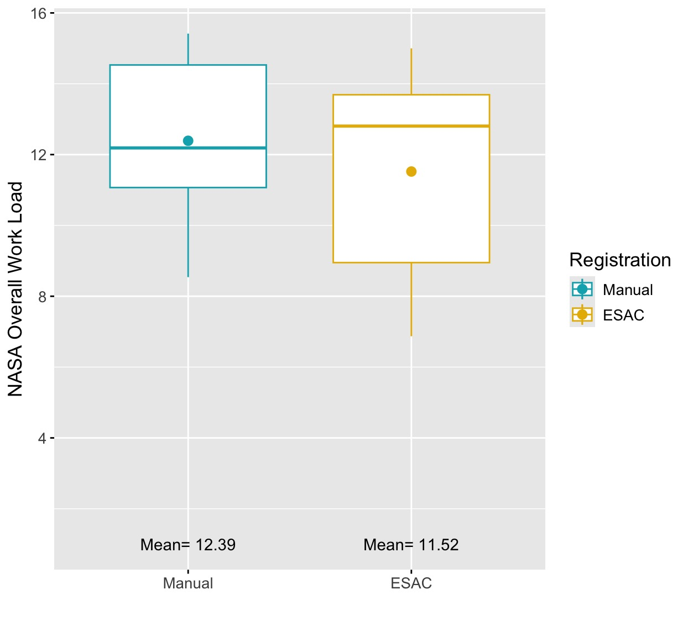
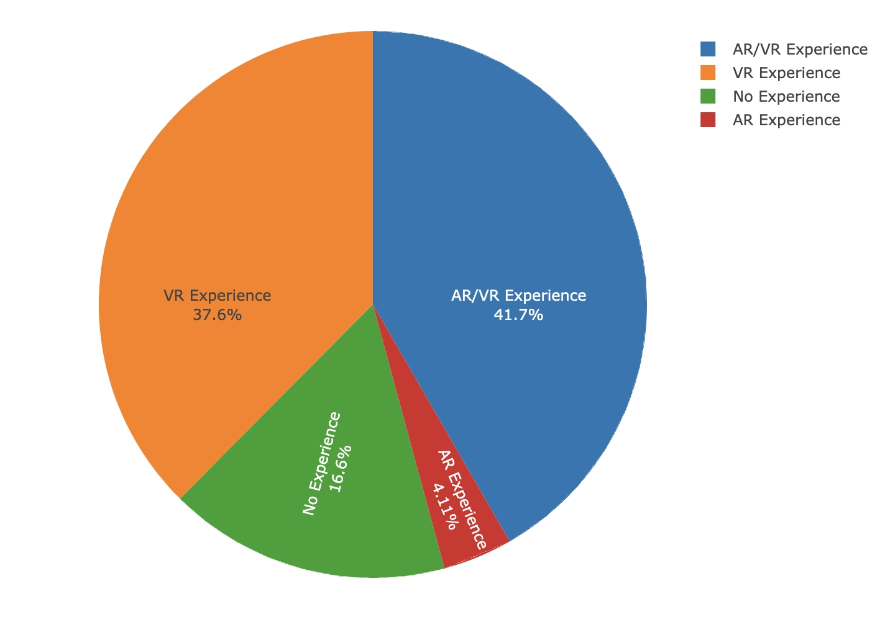
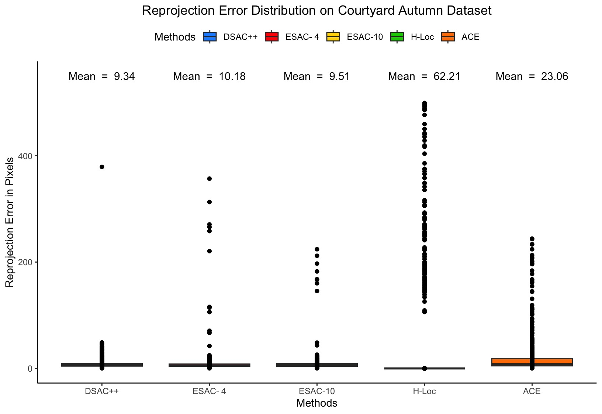
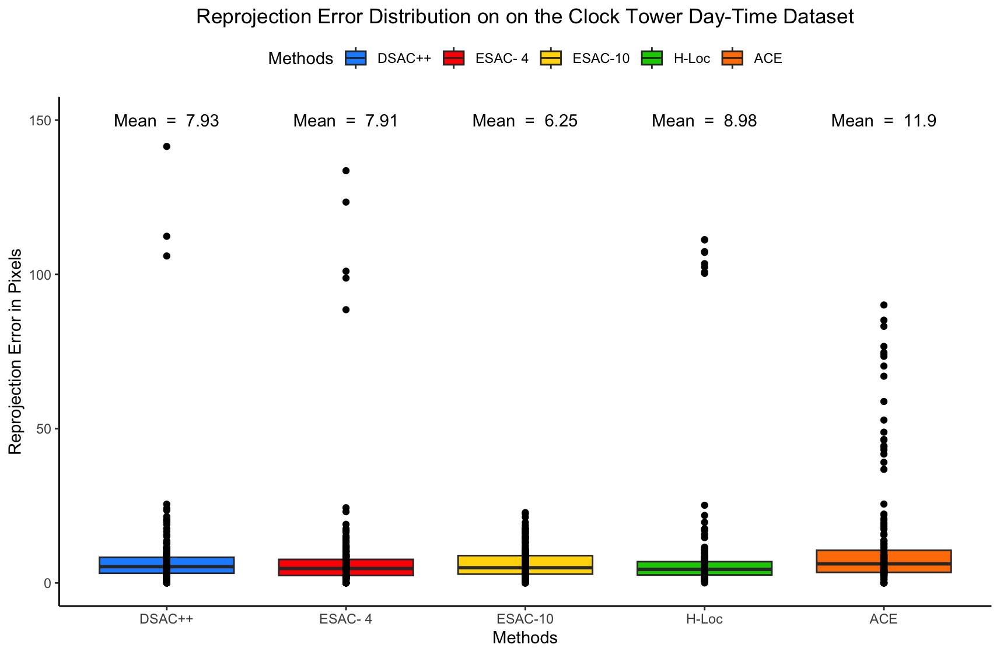
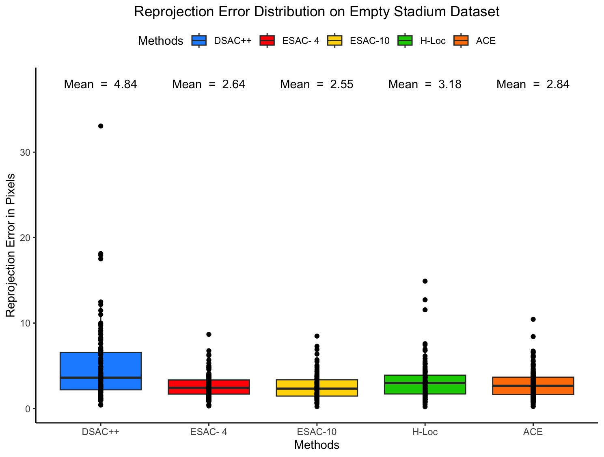
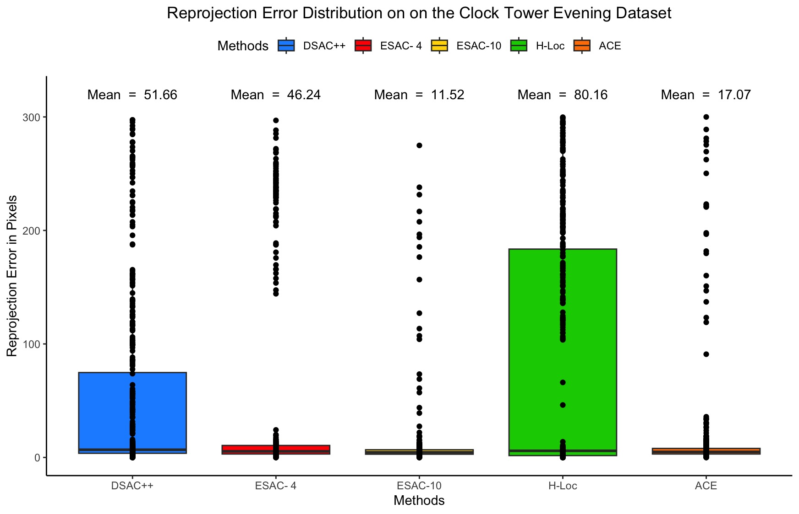

# R-Analysis-Toolkit-for-Experimental-Research

An R toolkit for experimental research data: give it a data file and it works
out the structure, runs a suitable statistical comparison and draws a
publication-style figure.

You do not need to rename columns or edit code. Column names such as `Score`,
`Method` or `Registration` are **not** required: the tool looks at the shape of
your data and, if it guesses wrong, lets you name the columns yourself.

> **Status:** written carefully but not yet verified on every machine. Before
> relying on it, run `Rscript tests/run_tests.R` (see [Testing](#testing)).


## Features

- Reads CSV, TSV, TXT, XLSX and XLS; separators are detected automatically.
- Detects grouping, outcome and subject columns without fixed column names.
- Handles long data (one group column + one value column) and wide data
  (one column per condition).
- Chooses between parametric and non-parametric tests, and between independent
  and paired designs, and explains the choice in a report.
- Reports effect sizes and post hoc comparisons for more than two groups.
- Colour-blind-safe box plots with individual points, group means and optional
  significance letters; PNG and PDF output; optional log axis for skewed data.
- Also handles ready-made percentage tables, categorical-only data and a single
  numeric column.

## Requirements

- R 4.0 or later
- `ggplot2` (version 3.3.0 or later) - required
- `readxl` - optional, only for `.xlsx` / `.xls` files
- `multcompView` - optional, adds significance letters to plots for more than
  two groups

```r
install.packages("ggplot2")
install.packages(c("readxl", "multcompView"))   # optional
```

## Quick start

**Get the code**

```bash
git clone https://github.com/shaziagul-rgb/R-Analysis-Toolkit-for-Experimental-Research.git
```

**RStudio** - open `R-Analysis-Toolkit-for-Experimental-Research.Rproj`, then:

```r
source("run.R")     # a file chooser opens; detected columns are shown for confirmation
```

**R console or script:**

```r
source("R/load.R"); load_project()

analyse("my_data.csv")                                        # fully automatic
analyse("my_data.xlsx", group = "Treatment", outcome = "Score")
analyse("my_data.csv", outcome = "all")                       # every numeric column
analyse("my_data.csv", columns = c("Manual", "Automatic"))    # one column per condition
```

**Terminal:**

```bash
Rscript run.R my_data.csv
Rscript run.R my_data.csv --group Treatment --outcome Score --log-y
Rscript run.R --help
```

Run everything from the project folder so that relative paths work.


## Output files

Results go to `outputs/<data file name>/` (change with `outdir`).

| Data type | Files |
|---|---|
| Group comparison | `groups_<outcome>.png/.pdf`, `_descriptives.csv`, `_test.csv`, `_posthoc.csv` (more than 2 groups), `_report.txt` |
| Wide layout | same as above, named `groups_comparison...` |
| Summary table | `bars_<value>.png/.pdf`, `bars_<value>_data.csv` |
| Categorical only | `frequency_<column>.png/.pdf`, `_table.csv` |
| Single numeric column | `distribution_<column>.png/.pdf`, `_descriptives.csv` |

The report lists descriptive statistics, assumption checks, the test used and
why, effect size, post hoc results and any notes (for example, subjects
excluded because of missing values).


## Project layout

```text
R-Analysis-Toolkit-for-Experimental-Research/
├── run.R                 entry point (RStudio or terminal)
├── R/
│   ├── load.R            attaches ggplot2 and loads the functions
│   ├── io.R              file reading and separator detection
│   ├── detect.R          column and layout detection
│   ├── stats.R           descriptives, assumption checks, tests, post hoc
│   ├── plots.R           figures
│   └── analyse.R         analyse() and report writing
├── examples/             small synthetic datasets
├── tests/run_tests.R     smoke tests
├── gallery/              archived PhD figures (images only)
└── docs/PROVENANCE.md    where the figures and the code come from
```

## Testing

The files in `examples/` are **synthetic** (randomly generated). They exist to
demonstrate and test the tool and are not research data.

```bash
Rscript tests/run_tests.R                                  # every line should say PASS
Rscript run.R examples/synthetic_long_3groups.csv
Rscript run.R examples/synthetic_wide_paired.csv --log-y
Rscript run.R examples/synthetic_repeated_measures.csv
```


## Gallery: archived PhD figures

These images are archived outputs from the PhD research. The original analysis
scripts and participant-level data are no longer available, so these figures
were **not** produced by the code in this repository and cannot be regenerated
from it. See [docs/PROVENANCE.md](docs/PROVENANCE.md).

<table>
<tr><td align="center"><br><sub>Mixed reality plausibility</sub></td><td align="center"><br><sub>Mixed reality registration</sub></td><td align="center"><br><sub>Nasa overall workload</sub></td></tr>
<tr><td align="center"><br><sub>Participant ar vr experience</sub></td><td align="center"><br><sub>Reprojection autumn</sub></td><td align="center"><br><sub>Reprojection crowded</sub></td></tr>
<tr><td align="center"><br><sub>Reprojection day</sub></td><td align="center"><br><sub>Reprojection empty</sub></td><td align="center"><br><sub>Reprojection evening</sub></td></tr>
<tr><td align="center"><br><sub>Reprojection night</sub></td><td align="center"><br><sub>Reprojection semi crowded</sub></td><td align="center"><br><sub>Reprojection spring</sub></td></tr>
<tr><td align="center"><br><sub>Reprojection summer</sub></td><td align="center"><br><sub>Reprojection winter</sub></td></tr>
</table>


