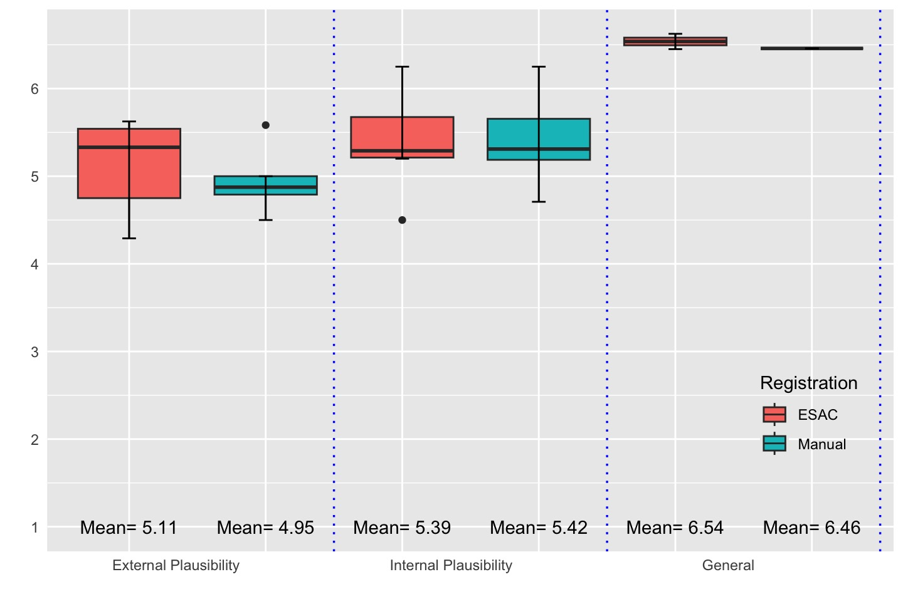
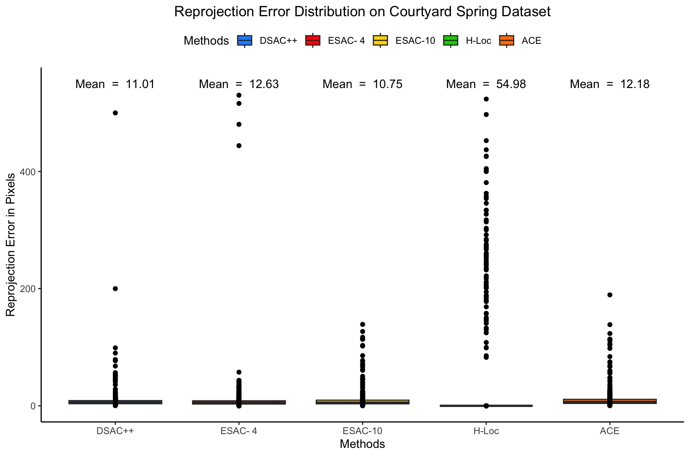
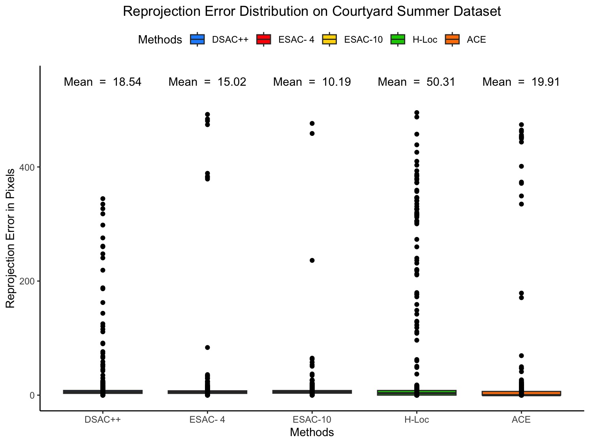
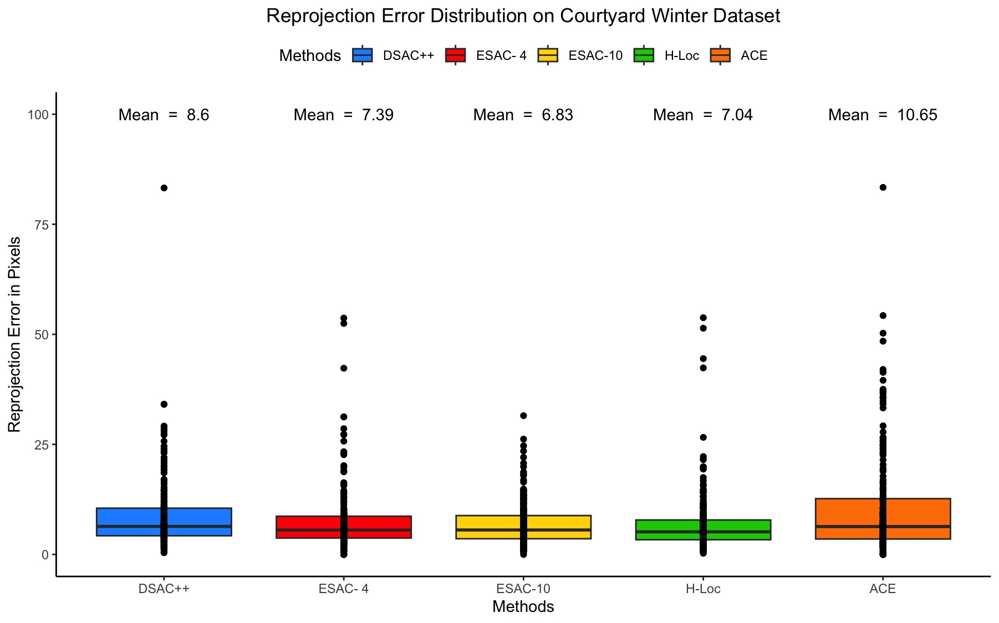
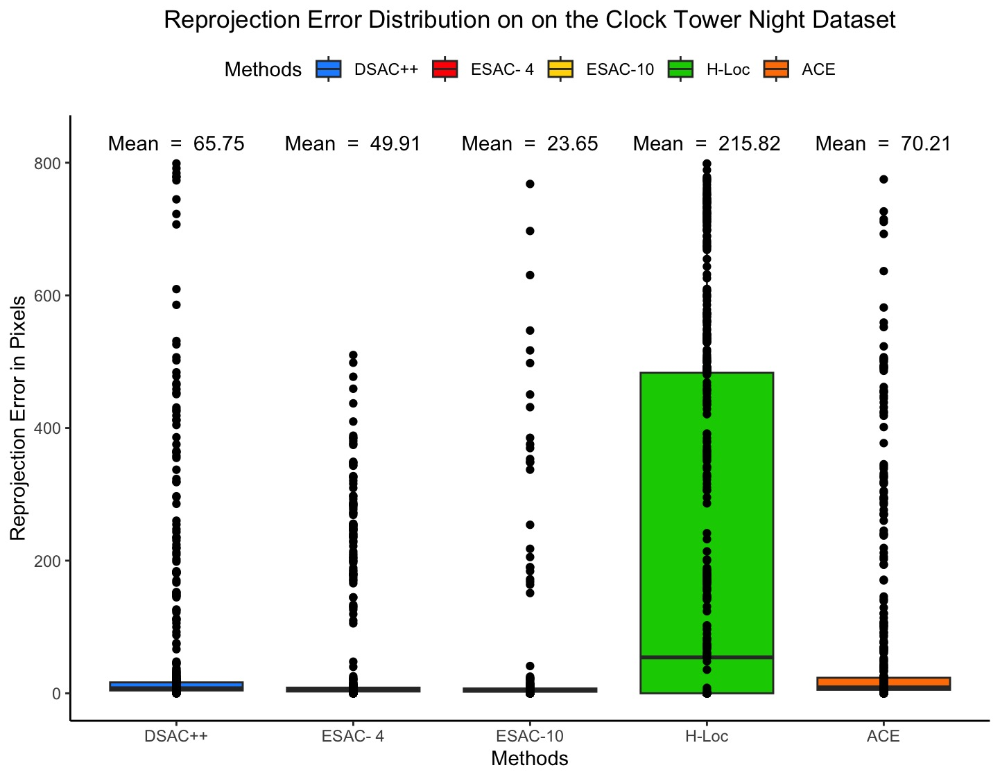
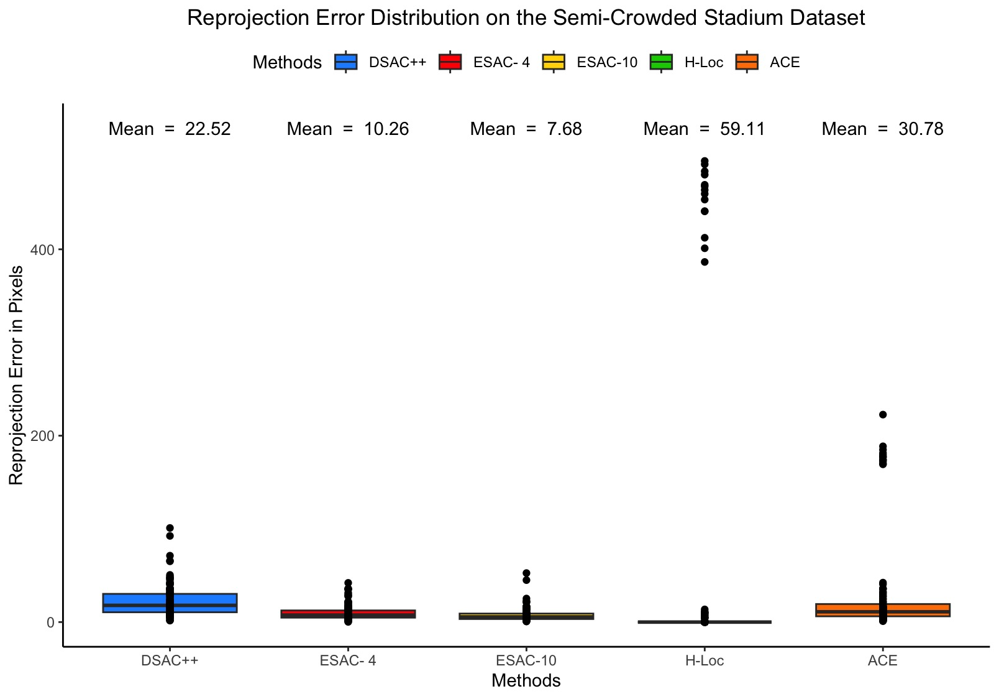
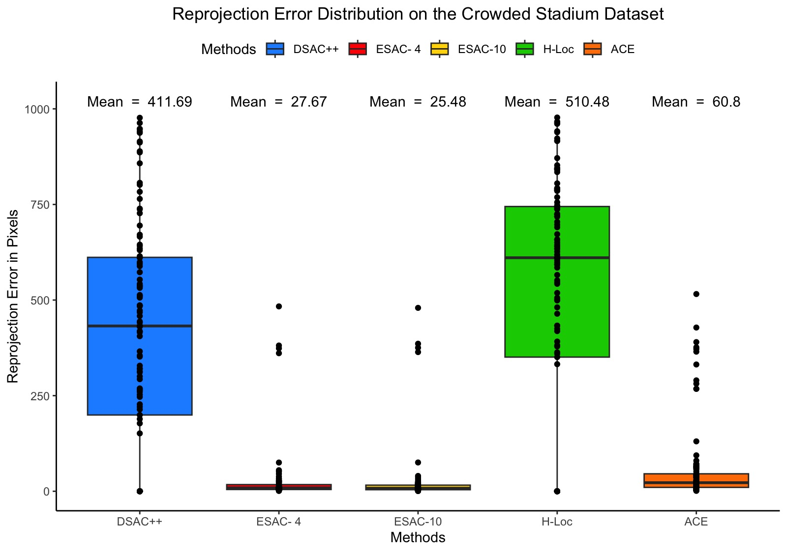

# PhD R Analysis

R scripts and archived figures from my PhD research.

This repository has been cleaned and reorganised from the original working
scripts so that the analysis code is easier to read, maintain, and reuse.

## What is included

- Cleaned R scripts with descriptive names and comments
- Repository-relative paths using the `here` package
- Reusable plotting setup and functions
- Statistical analysis for the paired confidence comparison
- Archived figures generated during the original PhD analysis
- Documentation of the original data requirements

## Repository structure

```text
.
├── R/
│   ├── 00_setup.R
│   ├── 01_nasa_workload.R
│   ├── 02_mixed_reality.R
│   ├── 03_reprojection_by_dataset.R
│   ├── 04_reprojection_by_crowding.R
│   ├── 05_confidence_wilcoxon.R
│   ├── 06_participant_experience.R
│   └── 07_response_distribution.R
├── data/
│   ├── raw/
│   └── processed/
├── figures/
│   ├── original/
│   └── reconstructed/
├── results/
├── docs/
└── original_scripts/
```

## Analysis scripts

| Script | Purpose | Original input |
|---|---|---|
| `01_nasa_workload.R` | Overall NASA-TLX workload | `NASA_TLX_ALL.csv` |
| `02_mixed_reality.R` | Mixed-reality ratings and Tukey HSD | `MR_all.txt` |
| `03_reprojection_by_dataset.R` | Reprojection error by method | `nn.csv` |
| `04_reprojection_by_crowding.R` | Reprojection error by crowding condition | `ff1.csv` |
| `05_confidence_wilcoxon.R` | Manual vs ESAC confidence | `confidence.csv` |
| `06_participant_experience.R` | AR/VR experience summary | Values recorded in original script |
| `07_response_distribution.R` | Archived response summary | Values recorded in original script |

## Running the analysis

Open the repository as an R project and run scripts from the project root.

First install the required packages:

```r
install.packages(c(
  "here",
  "readr",
  "dplyr",
  "ggplot2",
  "tibble",
  "agricolae"
))
```

Then, for example:

```r
source("R/01_nasa_workload.R")
```

The scripts use paths such as:

```r
here::here("data", "raw", "NASA_TLX_ALL.csv")
```

rather than machine-specific paths such as:

```text
/Users/your-name/...
```

This makes the project portable across computers.

## Archived figures

The original result figures generated during the PhD are preserved in
[`figures/original/`](figures/original/).

They can also be displayed directly on this GitHub page.

### NASA-TLX workload


### Mixed-reality registration


### Mixed-reality plausibility



### Participant AR/VR experience


## Reprojection-error results

### Spring



### Summer



### Autumn


### Winter



### Day


### Evening


### Night



### Empty stadium


### Semi-crowded stadium



### Crowded stadium



## Data availability

The original participant-level data files used in the PhD analysis are
currently unavailable. The repository therefore preserves the original
analysis code and the figures generated during the research.

Some percentages recorded directly in the cleaned analysis scripts are reproduced
in the archival scripts under `R/06_participant_experience.R` and
`R/07_response_distribution.R`.

**Important:** archived figures are not regenerated from recovered
participant-level data. Where the raw data are unavailable, this repository
does not claim that the original participant-level analysis can currently
be reproduced.

If the original data are recovered, place authorised and anonymised copies
in `data/raw/` and rerun the relevant scripts.

## Original scripts

The unmodified scripts supplied from the PhD archive are retained in
[`original_scripts/`](original_scripts/) for provenance. The cleaned
versions in `R/` are intended for future use.

## Citation

If these scripts or figures are used in a publication, thesis, presentation,
or other research output, please cite the associated PhD research and
repository release where appropriate.


## Interactive analysis with your own data

The repository also includes `R/interactive_analysis.R`, which is designed
for researchers who want to use the workflow with their own dataset.

The script does **not** assume that columns are named `Registration`,
`WorkLoad`, `Methods`, or any other project-specific name.

Instead, it:

1. Opens a file-selection window.
2. Lets you choose a CSV, TXT/TSV, XLSX, or XLS file.
3. Displays the available columns.
4. Lets you select the grouping/condition column.
5. Lets you select the numeric outcome column.
6. Generates a descriptive summary and publication-style boxplot.
7. Saves the figure to `figures/reconstructed/`.
8. Saves the summary table to `results/`.

### Example: NASA-TLX

For a NASA-TLX dataset, select:

- **Group / condition column:** the column identifying the experimental
  condition.
- **Numeric outcome column:** your overall NASA-TLX workload score.

The actual column names can be anything. For example:

```text
Condition      OverallScore
A              55
A              62
B              41
B              48
```

or:

```text
Registration   WorkLoad
AR             55
AR             62
VR             41
VR             48
```

Both work because the researcher selects the columns interactively.

### Run the interactive tool

From RStudio, run:

```r
source("R/interactive_analysis.R")
```

The tool will guide you through the analysis.

> **Note:** The interactive tool currently provides a general group-comparison
> workflow. More specialised analyses (for example, Tukey HSD, Wilcoxon tests,
> repeated-measures models, or method-specific reprojection analyses) should
> be added as separate modules when their statistical assumptions and required
> variables are known.
